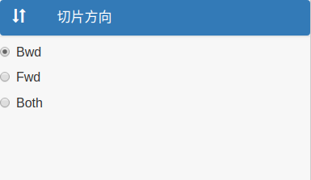
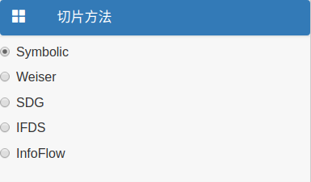
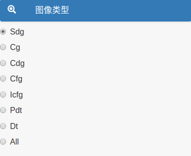

# 基础功能

## 1.选择切片方向

切片器提供了3种切片方向以供选择:Bwd,Fwd,Both.

默认选择Bwd.

## 2.选择切片方法

切片器提供了5种切片方法以供选择:Symbolic,Weiser,SDG,IFDS,InfoFlow.

默认选择Symbolic.

## 3.设置最大切片时间

最大切片时间单位为秒(second),超时后停止切片.

默认时间为1800秒(30分钟).

## 4.并行设置

在文件较大时,选择并行切片可提高切片速度.

默认为false.

## 5.选择图像类型

切片器提供了7种图像类型以供选择:Sdg,Cg,Cdg,Cfg,Icfg,Pdt,Dt.选择All时,切片器会生成所有7种类型的图像.

