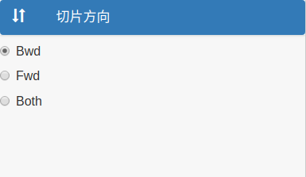
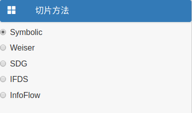
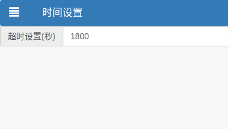
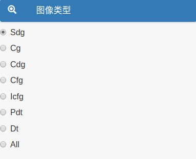
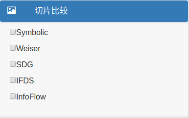
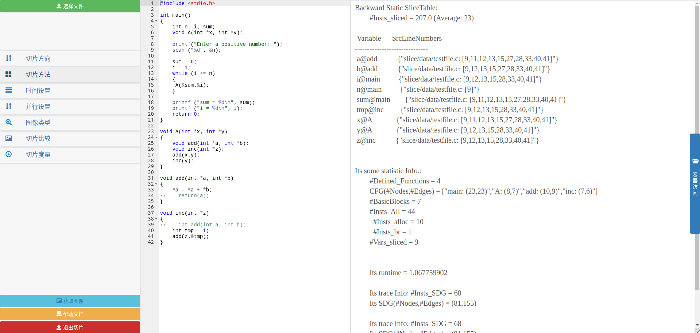
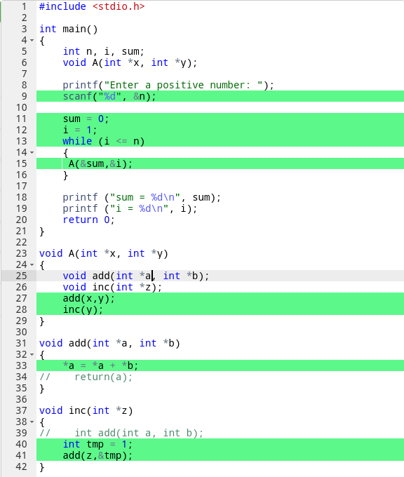
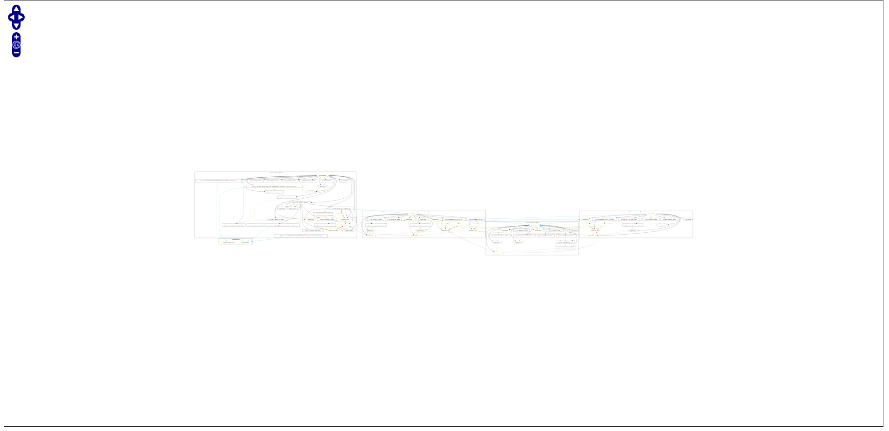
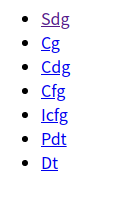

# 程序切片

## 基础功能

### 1.选择切片方向

切片器提供了3种切片方向以供选择:Bwd,Fwd,Both.

默认选择Bwd.

### 2.选择切片方法

切片器提供了5种切片方法以供选择:Symbolic,Weiser,SDG,IFDS,InfoFlow.

默认选择Symbolic.

### 3.设置最大切片时间

最大切片时间单位为秒(second),超时后停止切片.

默认时间为1800秒(30分钟).

### 4.并行设置

在文件较大时,选择并行切片可提高切片速度.

默认为false.

### 5.选择图像类型

切片器提供了7种图像类型以供选择:Sdg,Cg,Cdg,Cfg,Icfg,Pdt,Dt.选择All时,切片器会生成所有7种类型的图像.

## 附加功能

### 1.切片比较

比较两种不同切片方法的结果,接收一个或两个参数.

只有一个参数时,默认与Symbolic方法的切片结果进行比较.

### 2.切片度量

默认为False

## 开始切片

点击左下角的"开始切片"按钮,即可对code editor内的C程序进行切片,切片结果会显示在页面右侧.

## 参数捕获

切片完成后,在code editor内选中某个参数,切片器会高亮与该参数有关的行.以参数`a`为例:

## 获取图像

完成切片后,左下角会显示"获取图像"按钮,点击即可跳转到切片结果图像页面,图像为矢量图.

如果切片时图像类型未选择all,则按照所选择的图像类型显示图像.以Sdg为例:

如果切片时图像类型选择all,则展示所有类型图像的连接,点击某个类型后,跳转到对应类型.例如:点击Sdg后,跳转到Sdg类型图像的页面

